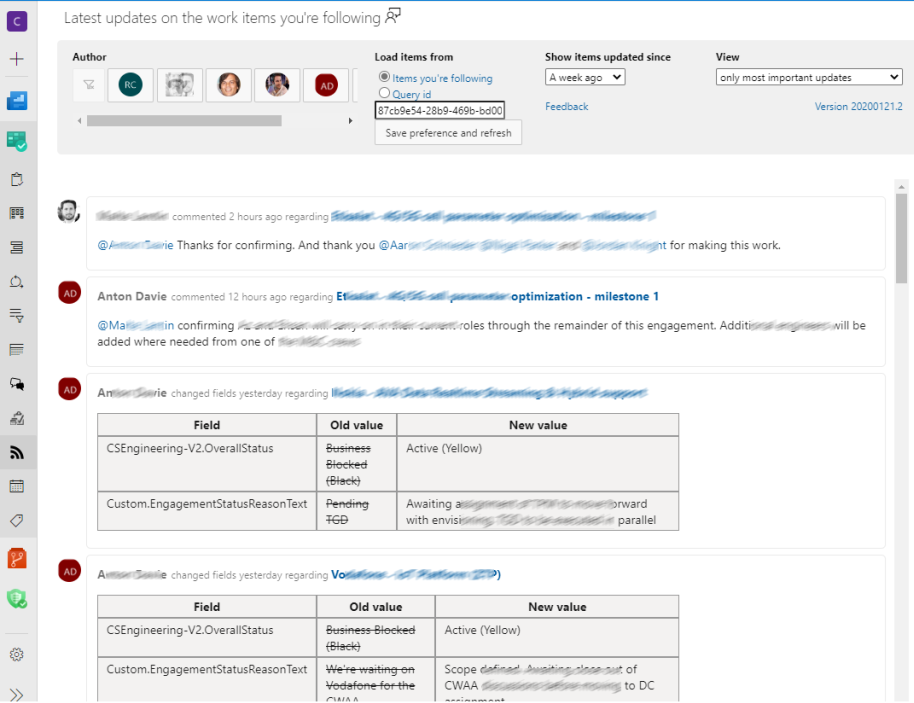
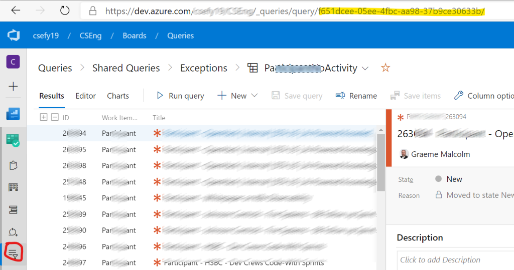
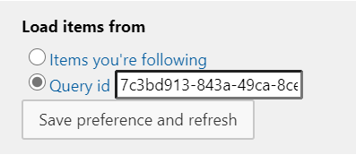
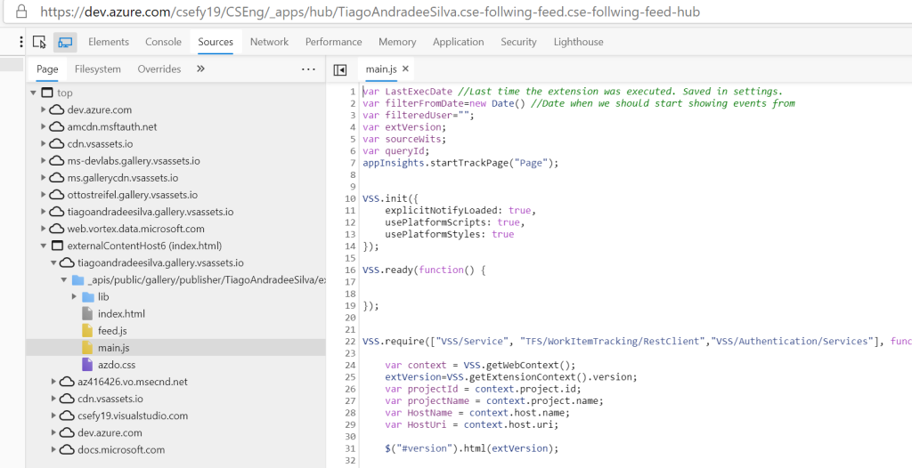
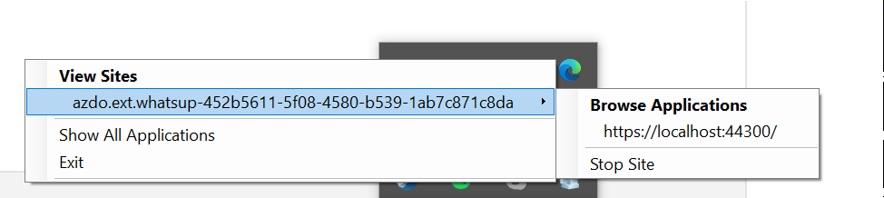
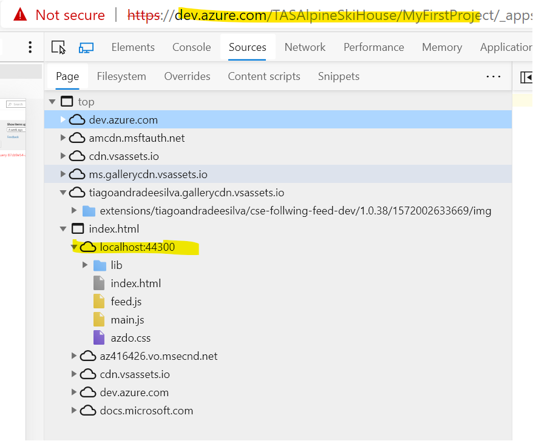

# Azure DevOps "What's UP?" feed Extension 

This [Azure DevOps](http://azure.com/devops) extension will show all recent updates on the work items you care about. 
It will can load work items from several sources: The items you are following, or a given query. 
It will then show all the recent changes (according to a date filter) so you can keep up with what's happening.



## Using the extension

### Installing
* Install the [Azure DevOps](http://azure.com/devops) extension from the [Marketplace](https://marketplace.visualstudio.com/manage/publishers/tiagoandradeesilva)

### Using the extesion

It has 2 possible modes of fetching the information. Either from all the work items you are following, or from all the work items in a given query.

* From items you follow

> Start by following some items clicking on the “Follow” button (check [here](https://docs.microsoft.com/en-us/azure/devops/boards/work-items/follow-work-items?view=azure-devops#follow-a-work-item) for more info).


* From a query id

1. Find a query that you want to follow (or create a new query) and add the query id to the "Query id" filed in the header of the extension

> 

2. make sure you select "Query id" as the source.

> 

## Developing

### Prerequisites
To [develop and test your extension](https://docs.microsoft.com/en-us/azure/devops/extend/get-started/node?view=azure-devops), you need:
1.  An organization where you have permission to install extensions to (that is, you are the owner).
If you don't have a personal organization, you can [create an organization for free](https://app.vsaex.visualstudio.com/profile/account).
2.  Install [Node.js](https://nodejs.org/)
3. Install the extension packaging tool (TFX) by running npm install -g tfx-cli from a command prompt

### Debug online
* You can load the extension in your browser and launch developer tools. 


### Debug locally
* Install [Visual Studio Code](https://code.visualstudio.com/)
* Install [IIS Express VS Code extension](https://marketplace.visualstudio.com/items?itemName=warren-buckley.iis-express)
* Install the [Debugger for Firefox](https://marketplace.visualstudio.com/items?itemName=hbenl.vscode-firefox-debug) extension for Visual Studio Code.
>we use Firefox because the Visual Studio Code – Debugger for Chrome extension doesn’t yet support iframes. If you would prefer to debug your extension in Chrome, please add your support to this [feature request](https://github.com/microsoft/vscode-chrome-debug/issues/786).
*  Enable Firefox debugging in your Visual Studio Code launch.json file (Step 3 in [this post](https://devblogs.microsoft.com/devops/streamlining-azure-devops-extension-development/))
* Now you need to load a azure dev ops extension that you previously published that is pointing at your localhost, and port that IIS is running.

IIS running locally, after having loaded the exception code:

> 

Navigating to the development extension that points to localhost:

> 

### Installing

A step by step series of examples that tell you how to get a development env running demo

## Deployment / Publishing

To [publish the extension from the command line](https://docs.microsoft.com/en-us/azure/devops/extend/publish/command-line?view=azure-devops)

You can check your tokens following the link 'https://dev.azure.com/username/_usersSettings/tokens' (replace username with yours)

```
tfx extension publish --manifest-globs vss-extension.json --overrides-file configs/dev.json --token <yourtoken>
```

## Contributing

Please read [CONTRIBUTING.md](https://gist.github.com/PurpleBooth/b24679402957c63ec426) for details on our code of conduct, and the process for submitting pull requests to us.

## Authors

* **Tiago Andrade e Silva** 

See also the list of [contributors](https://github.com/tiagonmas/azdo.ext.whatsup/contributors) who participated in this project.

## License

This project is licensed under the MIT License - see the [LICENSE.md](LICENSE.md) file for details

## Other relevant documentation

* [Developing Azure DevOps extensions](https://docs.microsoft.com/en-us/azure/devops/extend/overview?toc=%2Fazure%2Fdevops%2Fextend%2Ftoc.json&bc=%2Fazure%2Fdevops%2Fextend%2Fbreadcrumb%2Ftoc.json&view=azure-devops)
* [Streamlining Azure DevOps extension development](https://devblogs.microsoft.com/devops/streamlining-azure-devops-extension-development/)
* [Azure DevOps Extension Hot Reload and Debug](https://github.com/microsoft/azure-devops-extension-hot-reload-and-debug)
* [Let's Make a Visual Studio Team Services Extension](https://www.nocture.dk/2016/01/02/lets-make-a-visual-studio-team-services-extension/)

### Extension design links
* Formula Design System https://developer.microsoft.com/en-us/azure-devops/
* Icons https://developer.microsoft.com/en-us/fabric#/styles/web/icons

## Acknowledgments

* Hat tip to David Hathaway <David.Hathaway@microsoft.com> who helped out on how to debug extensions (following up on his [blog post](https://devblogs.microsoft.com/devops/streamlining-azure-devops-extension-development/)


